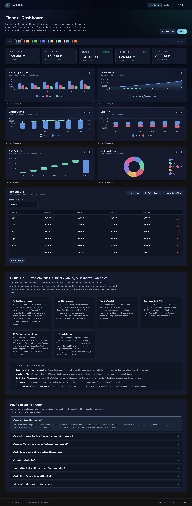
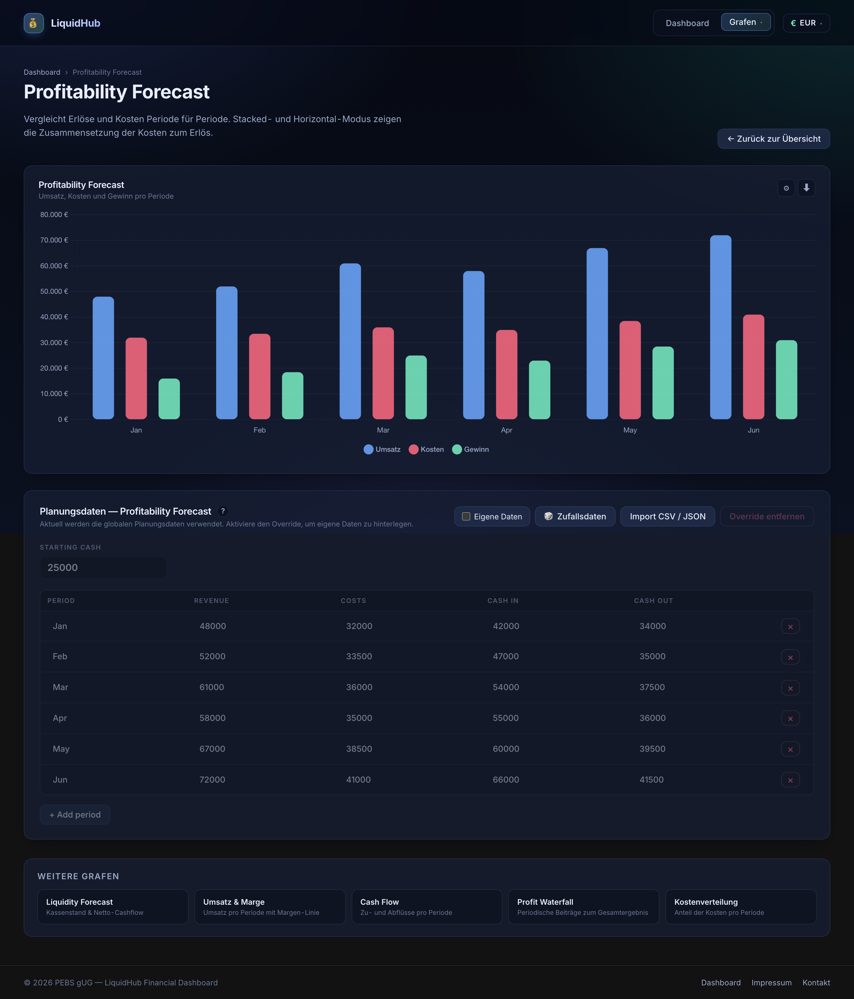
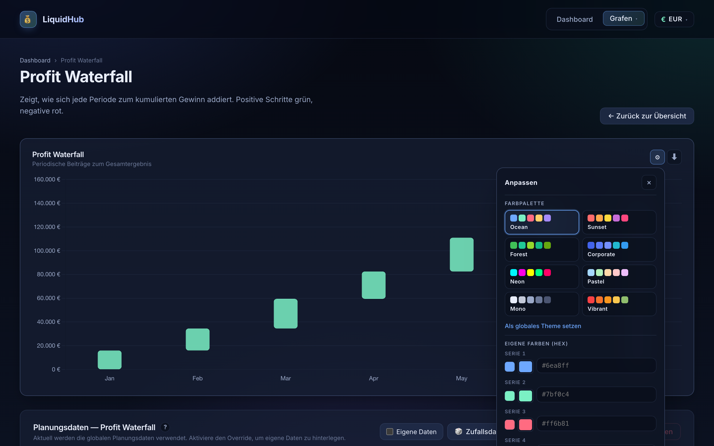
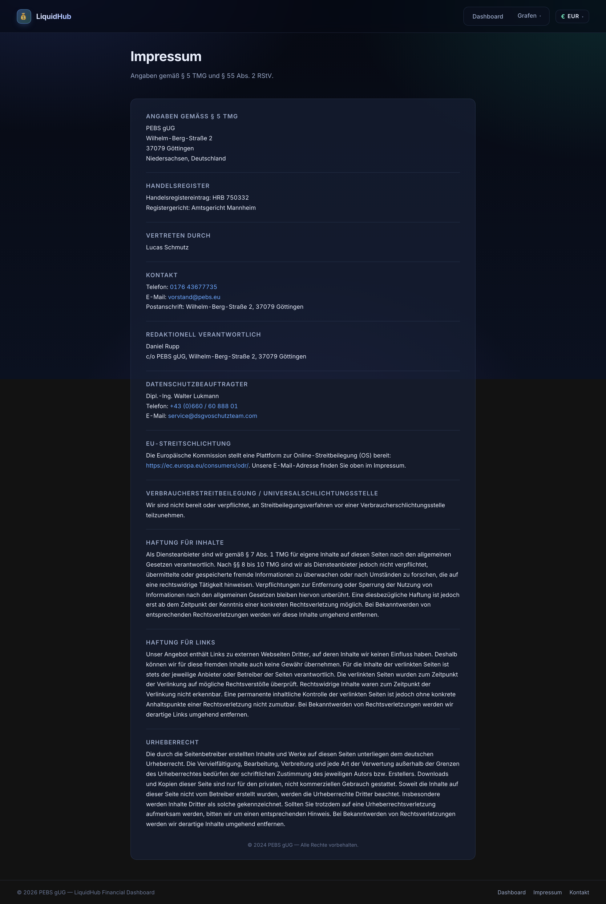

# LiquidHub

> Interactive dashboard for liquidity planning, profitability forecasting, and cashflow visualisation — built for founders, consultants, and controllers who need more than an Excel template.

[](https://github.com/lucasterix/liquidhub/actions)




---

## What is it

LiquidHub is a single-page financial dashboard that turns a compact dataset
(label, revenue, costs, cash-in, cash-out per period) into a full suite of
live-updating charts. It is the tool I reach for when a client needs a
liquidity forecast, a rentability projection, or a pitch-deck-ready chart in
an hour rather than a day.

The entire app is client-side. Planning data is kept in `localStorage`; the
backend exists only to serve static assets and optional aggregation
endpoints. Every chart can be themed individually, switched to a different
chart type on the fly, and exported as PNG, CSV, or JSON.

**Live deployment:** <https://pebs.eu/liquidhub> (hosted on Hetzner, managed
by [PEBS gUG](https://pebs.eu))

## Feature highlights

| Area | What you get |
|---|---|
| **Six core charts** | Profitability, Liquidity forecast, Revenue + Margin combo, Cash-Flow, Profit Waterfall, Cost Structure |
| **13 chart types** | bar, stacked-bar, horizontal-bar, horizontal-stacked, line, area, step-line, doughnut, pie, polar-area, radar, waterfall, combo |
| **Theme system** | 8 curated palettes (Ocean, Sunset, Forest, Corporate, Neon, Pastel, Mono, Vibrant) plus per-series custom hex overrides |
| **Per-chart planning data** | Each chart can optionally use its own dataset; global data acts as a fallback |
| **13 currencies** | EUR, USD, GBP, CHF, JPY, CNY, SEK, NOK, DKK, PLN, CZK, CAD, AUD — all axes, tooltips, and KPIs re-render live |
| **Exports** | PNG (1x/2x/3x), clipboard copy, CSV, JSON |
| **Sample data** | One-click realistic randomised datasets from five business scenarios |
| **Import** | CSV & JSON drag-drop with inline format help |
| **Accessible UX** | Portalled popovers (z-index & scroll-inside safe), full keyboard close (Esc), click-outside, responsive grid |
| **SEO / a11y** | JSON-LD structured data (`WebApplication` + `FAQPage`), Open Graph, FAQ section, semantic HTML |

## Screenshots

| Chart detail page | Settings popover |
|---|---|
|  |  |

| Impressum |
|---|
|  |

## Architecture

```
┌─────────────────────────────────────────────────────────────────┐
│                          Browser (client)                       │
│                                                                  │
│  React 18 + TypeScript 5 + Vite 5                                │
│  ┌──────────────────────────────────────────────────────────┐   │
│  │  Presentation                                             │   │
│  │    pages/          Dashboard, ChartDetailPage, Impressum  │   │
│  │    components/     ChartCard, ChartsMenu, FaqSection, …   │   │
│  │    charts/         6 Chart.js wrappers                    │   │
│  └──────────────────────────────────────────────────────────┘   │
│  ┌──────────────────────────────────────────────────────────┐   │
│  │  State (Zustand + persist middleware)                     │   │
│  │    useDataStore     global + per-chart overrides          │   │
│  │    useChartTheme    per-chart config, palettes, hex       │   │
│  │    useCurrency      selected currency code                │   │
│  └──────────────────────────────────────────────────────────┘   │
│                                                                  │
└──────────────────────────┬───────────────────────────────────────┘
                           │ HTTPS
┌──────────────────────────┴───────────────────────────────────────┐
│                  Hetzner VPS 188.245.172.75                      │
│                                                                  │
│  nginx (host)  →  docker compose                                 │
│                      │                                           │
│                      ├── liquidhub-frontend (nginx + dist/)      │
│                      └── liquidhub-backend  (Express, health)    │
│                                                                  │
│  systemd timer  liquidhub-self-update.timer  (every 60 s)        │
│       │                                                          │
│       └─ git fetch → rebuild → docker compose up -d              │
└──────────────────────────────────────────────────────────────────┘
```

## Deploy pipeline

Deployment is **pull-based**. A systemd timer on the server runs every
60 seconds, checks `origin/main`, and, on a new commit, runs a lock-file
guarded script that rebuilds and restarts the containers. This removes the
need for SSH secrets on the CI runner and makes rollbacks a trivial
`git reset`.

```
git push → GitHub → (CI build verify) → systemd timer picks up → rebuild → live (<60 s)
```

GitHub Actions only compiles the project to catch regressions early —
actual deploy happens on the server.

## Tech stack

- **React 18** + **TypeScript 5**
- **Vite 5** for dev/build
- **Chart.js 4.4** + **react-chartjs-2 5** (BarController, LineController, DoughnutController, PieController, PolarAreaController, RadarController, ArcElement, Filler)
- **Zustand 4** with `persist` middleware (`localStorage`)
- **React Router 6**
- **Express 4** (backend health endpoint + optional analysis API)
- **Docker Compose** orchestration
- **nginx** host reverse-proxy
- **systemd** self-update timer

## Project structure

```
liquidhub/
├── frontend/
│   ├── public/favicon.svg
│   ├── index.html                 # SEO meta + JSON-LD FAQ schema
│   └── src/
│       ├── pages/                 # Dashboard, ChartDetailPage, Impressum
│       ├── components/            # ChartCard, 6 chart types, menus, popovers
│       ├── store/                 # Zustand stores (data, theme, currency)
│       ├── theme/                 # palettes + useChartTheme
│       ├── lib/                   # finance helpers, sample data generator
│       ├── styles/global.css
│       └── types/index.ts
├── backend/
│   └── src/                       # Express server, /health, /api/*
├── docker-compose.yml
├── .github/workflows/deploy.yml   # CI build verify
└── docs/screenshots/              # README assets
```

## Development

```bash
# Frontend (http://localhost:3000)
cd frontend
npm install
npm run dev

# Backend (http://localhost:5000)
cd backend
npm install
npm run dev

# Full stack in Docker
docker compose up -d --build
```

## Engineering notes

A few things that turned out to matter more than expected:

- **Stacking contexts bite.** `backdrop-filter` on the chart card created a
  stacking context that clipped settings popovers behind the next chart.
  The fix was portalling them into `document.body` with `position: fixed`
  and a resize-/scroll-/click-outside guard — and crucially, a scroll
  listener that **checks the event target** so scrolling *inside* the
  popover does not dismiss it.
- **`line` vs `area` must not look the same.** A single "fill" toggle
  quietly made both chart types identical. The cleaner model is:
  area always fills, line never fills, drop the toggle.
- **Stacked bars with distinct `stack` keys are silent bugs.** If every
  dataset sets a different stack key, Chart.js groups them side-by-side
  even with `scales.stacked = true`. Revenue ≠ costs + profit when all
  three are shown on one stack, so the stacked mode of the Profitability
  chart now drops the revenue series and stacks costs + profit (which
  mathematically sums to revenue).
- **Currency re-renders need explicit subscription.** `formatEUR` reads
  the currency at call time, but Chart.js only re-draws when React
  passes a new options object. Every chart component subscribes to the
  currency store (`useCurrencyCode()`) so a switch triggers a re-render
  and the tooltip/axis callbacks close over the new locale.

## License

MIT

## About

Built by **Lucas Schmutz** ([@lucasterix](https://github.com/lucasterix)) for
[PEBS gUG](https://pebs.eu), a non-profit in Göttingen focused on education
and practical digital tooling. Drop a line at
[vorstand@pebs.eu](mailto:vorstand@pebs.eu) if you want to talk about
liquidity planning, consulting, or full-stack engineering.

---

[Impressum](https://pebs.eu/impressum) · [Kontakt](mailto:vorstand@pebs.eu)
